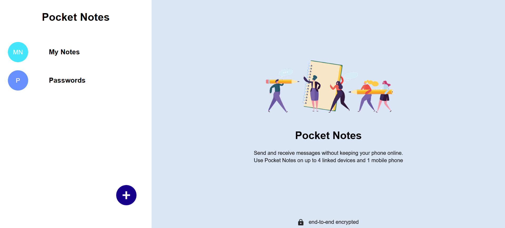
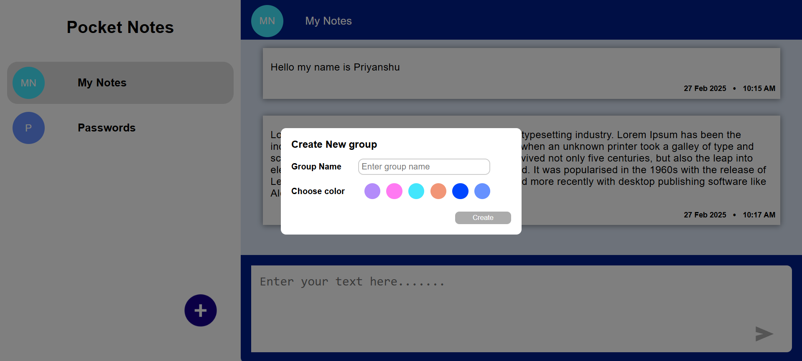
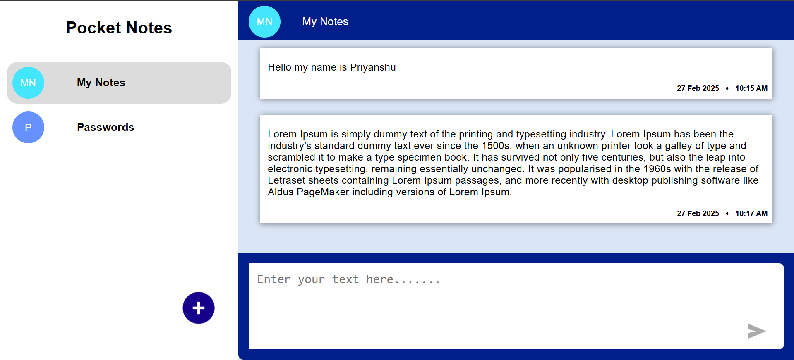
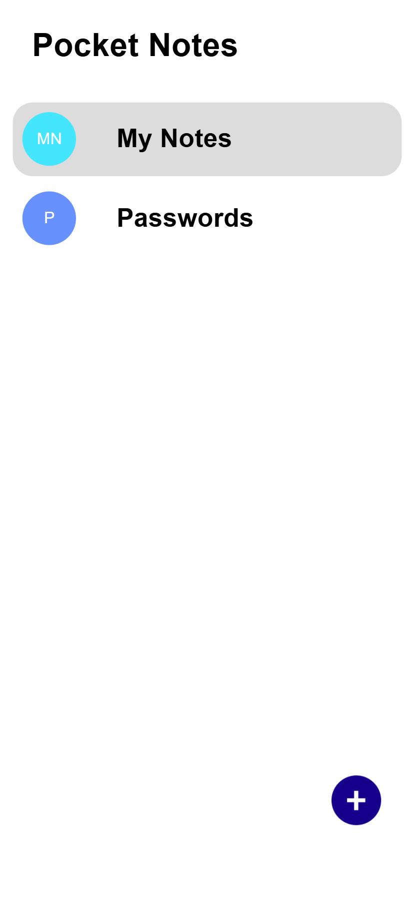
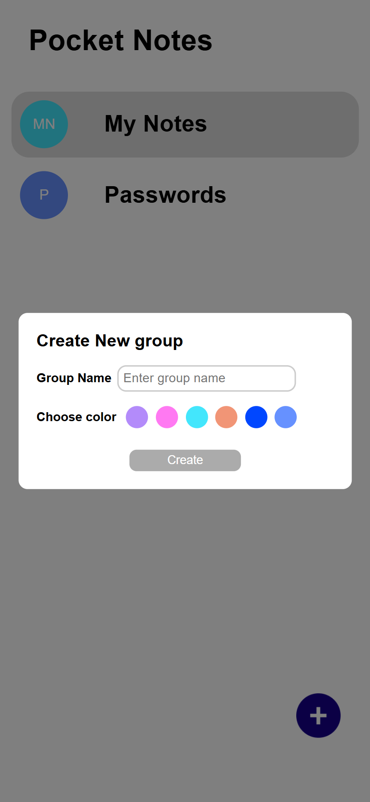
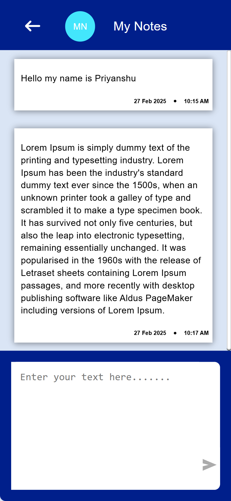

# 📝 Pocket Notes

Pocket Notes is a **note-taking application** that allows users to create, organize, and manage their notes efficiently. It provides a seamless user experience with features like categorized notes, timestamps, and a responsive design.

## 🚀 Features

- 📂 **Group-based Notes:** Organize notes into different categories.
- ⏳ **Timestamps:** Automatically records the date and time of note creation.
- 📱 **Responsive Design:** Works smoothly on both **desktop and mobile**.
- 🔄 **Local Storage:** Saves notes persistently using `localStorage`.

## 🛠 Tech Stack

- **Frontend:** React.js, CSS Modules
- **State Management:** React Context API
- **Routing:** React Router (for mobile navigation)
- **Storage:** LocalStorage (for persistent note saving)

## 📷 Screenshots

### 🖥 Desktop View




### 📱 Mobile View

)


## 📦 Installation

### 1️⃣ Clone the Repository
```sh
git clone https://github.com/your-username/pocket-notes.git
cd pocket-notes
```
### 2️⃣ Install Dependencies
```sh
npm install
```
### 3️⃣ Run the App
```sh
npm start
```
## 📖 Usage

1. Click the ➕ Add button to create a new note group.
2. Select a group from the sidebar to start adding notes.
3. Use the textarea to type a note and press Enter to submit.
4. On mobile, tap a group to navigate to its notes.

## 📌 Responsive Navigation (Mobile)

1. On desktop, the sidebar and notes are visible side by side.
2. On mobile, clicking a sidebar item navigates to the notes page.

## 🔧 Future Enhancements

- 🛑 Trash Bin: Restore deleted notes.
- ☁️ Cloud Sync: Sync notes with an online database.
- 🎨 Themes: Light & dark mode support.

##👨‍💻 Author

Priyanshu Ghosh
💼 Full Stack Developer
📧 Email: ghosh.priyanshu2001@gmailcom
🔗 LinkedIn | GitHub
